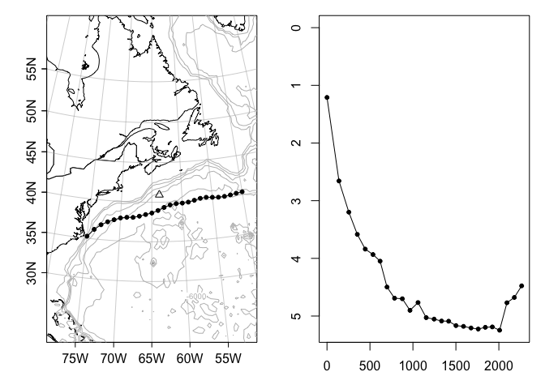
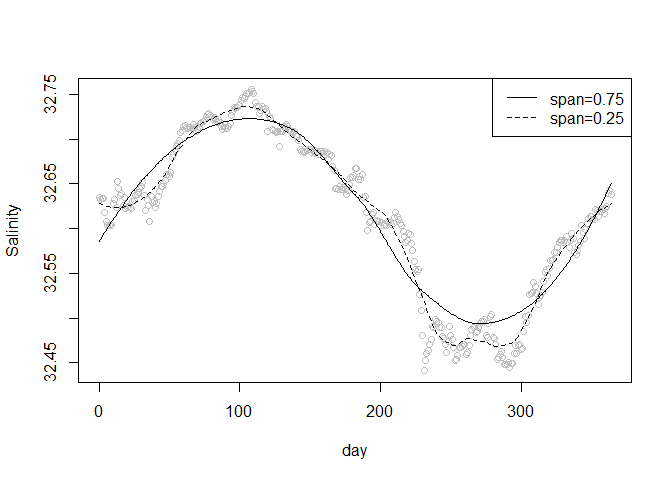
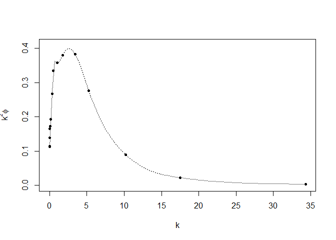
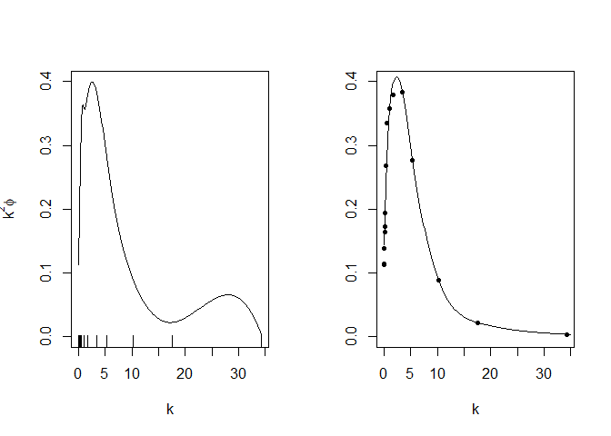
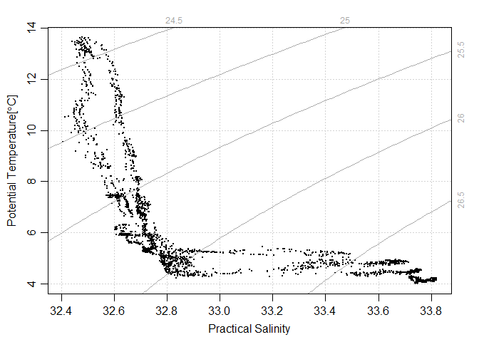
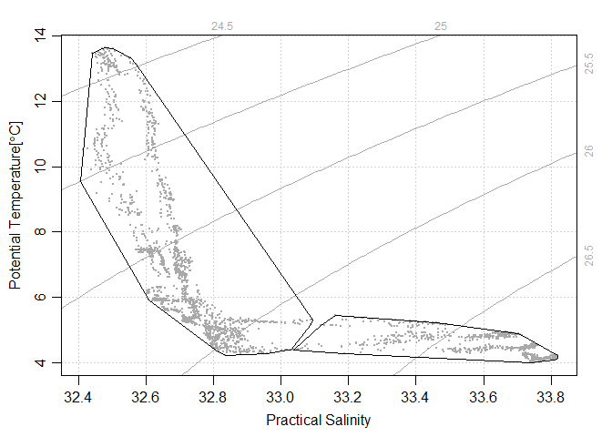
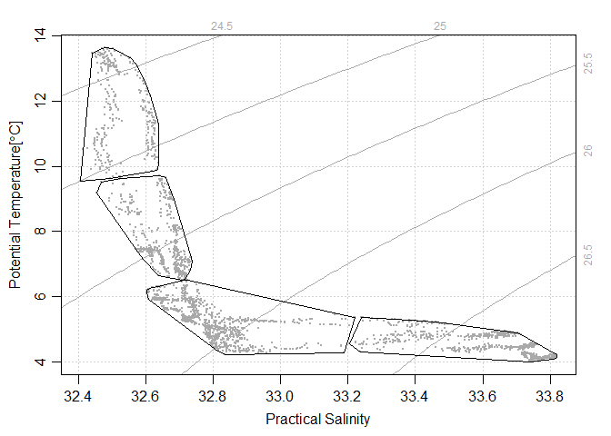
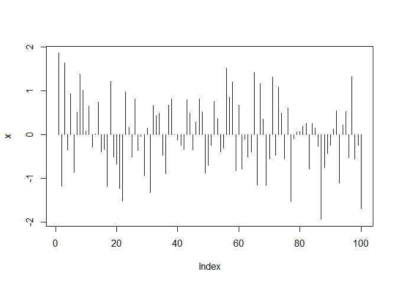
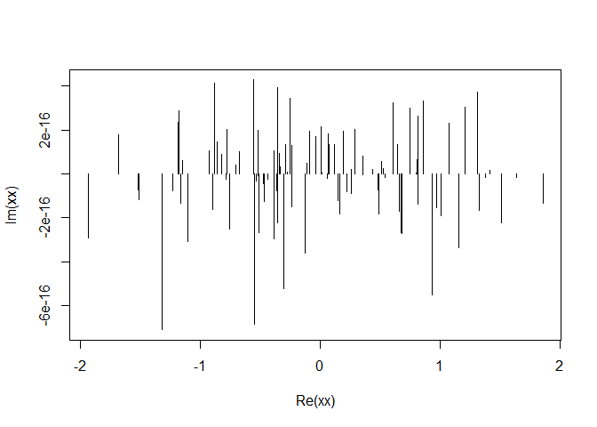

Ch2.6 OCE of Kelley
================
Taeyoon Song
February 24, 2020

## GitHub Documents

This is an R Markdown format used for publishing markdown documents to
GitHub. When you click the **Knit** button all R code chunks are run and
a markdown file (.md) suitable for publishing to GitHub is generated.

## 2.6.1 sorting

sort()는 정열된 벡터를 반환, 반면 order()는 데이터의 인덱스를 정열될 순서로 나열:

``` r
data(oceans, package="ocedata")
oceansOrdered <- oceans[order(oceans$AvgDepth),] # 컬럼기준 매트릭스 정열
oceans$rankByAvgDepth <- order(order(oceans$AvgDepth, decreasing = TRUE)) # Ranking 반환
```

## 2.6.2 해찾기

일변량 함수의 해는 `uniroot()`로 찾을 수 있음: 다항식  의 해찾기

``` r
polyroot(c(-1, 0, 1))
```

    ## [1]  1+0i -1+0i

## 2.6.3 적분

함수의 적분은 `integrate()`   
  

``` r
integrate(sin, 0, pi)
```

    ## 2 with absolute error < 2.2e-14

``` r
woa <- function(x, a=1)
  8 * a^3 / (x^2 + 4*a^2)
integrate(woa, -Inf, Inf)
```

    ## 12.56637 with absolute error < 1.3e-09

``` r
# Ex. 2.39
a <- 2
b <- 1
integrate(function(t)
  4*a*sqrt(1-(a^2-b^2)/a^2*sin(t)^2), 0, pi/2)
```

    ## 9.688448 with absolute error < 3.5e-10

## 2.6.4 Piecewise Linear Interpolation

``` r
data(ctd, package="oce")
p <- ctd[["pressure"]]
S <- ctd[["salinity"]]
Sinterp <- approx(p, S, seq(0, max(p), 0.5))$y
```

    ## Warning in regularize.values(x, y, ties, missing(ties)): collapsing to unique
    ## 'x' values

``` r
Sinterp
```

    ##  [1]       NA       NA       NA 29.92095 29.92059 29.92102 29.93364 29.95277
    ##  [9] 29.96976 30.12039 30.58780 30.77322 30.83560 30.92304 30.89010 30.92513
    ## [17] 30.96769 30.98939 31.02860 31.08169 31.09813 31.20260 31.20869 31.20815
    ## [25] 31.20885 31.26143 31.26104 31.27251 31.27565 31.29154 31.30949 31.30251
    ## [33] 31.35490 31.36916 31.37091 31.37815 31.37668 31.39969 31.40535 31.39840
    ## [41] 31.39832 31.39905 31.39652 31.42063 31.41852 31.42646 31.42914 31.44187
    ## [49] 31.43772 31.44280 31.44489 31.44937 31.44523 31.44506 31.44808 31.44164
    ## [57] 31.44225 31.44015 31.46703 31.43874 31.44648 31.46147 31.44558 31.45472
    ## [65] 31.44221 31.43161 31.42870 31.42552 31.42157 31.42086 31.41715 31.42057
    ## [73] 31.41248 31.41267 31.40959 31.41225 31.43074 31.40808 31.40724 31.40201
    ## [81] 31.39897 31.39681 31.39885 31.39535 31.40666 31.41978 31.39375 31.38905
    ## [89] 31.39440

  
  

``` r
data(turbulence, package="ocedata")
k <- turbulence$k
phi <- turbulence$phi
plot(k, k^2*phi, pch=20, ylim=c(0, 0.41),
     xlab=expression(k), ylab=expression(k^2*phi))
lfcn <- approxfun(k, k^2 * phi)
kk <- seq(min(k), max(k), length.out=100)
lines(kk, lfcn(kk))
```

<!-- -->

``` r
I <- integrate(lfcn, min(k), max(k))
nu <- 1e4 * swViscosity(35, 10) / swRho(35, 10, 10, eos="unesco")
15 * nu * I$value
```

    ## [1] 0.6810874

## 2.6.6 Two-Dimentsional Interpolation

직사각형 그리드 상에 내삽하는 2차원 케이스는 `fields` 패키지의 `interp.surface()`로 다룬다. (2차원
맵에서 수심의 결측치 또는 내삽를 구할 때; 수학에서 *이중선 보간*은 직선 2D 그리드에서 두 변수의 함수를
보간하기위한 선형 보간의 확장입니다. 쌍방향 보간은 먼저 한 방향으로 선형 보간을 사용하여 수행 한 다음 다른
방향으로 다시 수행합니다.) ") local bilinear interpolation   
(1-y^\\prime)z_{00} + 91-x^\\prime)\\,y^\\prime \\,z_{01} + x^\\prime(1-y^\\prime)\\,z_{10} + x^\\prime y^\\prime z_{11}")  
  
  
\#\#\# Ex. 2.40 경로를 따라 수심 H가 어떻게 변하는지를 지도로 그려라.

``` r
library(fields)
```

    ## Warning: package 'fields' was built under R version 3.6.2

    ## Loading required package: spam

    ## Warning: package 'spam' was built under R version 3.6.2

    ## Loading required package: dotCall64

    ## Loading required package: grid

    ## Spam version 2.5-1 (2019-12-12) is loaded.
    ## Type 'help( Spam)' or 'demo( spam)' for a short introduction 
    ## and overview of this package.
    ## Help for individual functions is also obtained by adding the
    ## suffix '.spam' to the function name, e.g. 'help( chol.spam)'.

    ## 
    ## Attaching package: 'spam'

    ## The following objects are masked from 'package:base':
    ## 
    ##     backsolve, forwardsolve

    ## Loading required package: maps

    ## See https://github.com/NCAR/Fields for
    ##  an extensive vignette, other supplements and source code

    ## 
    ## Attaching package: 'fields'

    ## The following object is masked from 'package:testthat':
    ## 
    ##     describe

``` r
library(ocedata)
```

    ## Warning: package 'ocedata' was built under R version 3.6.2

``` r
data(gs, package="ocedata")
lon <- rev(gs$longitude)
lat <- rev(apply(gs$latitude, 1, mean))
data(coastlineWorldMedium, package="ocedata")
par(mfrow=c(1,2), mar=c(3,3,1,1))
mapPlot(coastlineWorldMedium, proj="+proj=lcc +lon_0=-65 +ellps=WGS84", grid=c(5,5),
        longitudelim=c(280, 310),
        latitudelim=c(35, 50))
data(topoWorld, package = "oce")
z <- topoWorld[["z"]]
x <- topoWorld[["longitude"]]
y <- topoWorld[["latitude"]]
mapContour(x, y, z, levels=seq(-6000, -1000, 1000), col="gray")
mapLines(lon, lat, type="o", pch=20)
mapPoints(-(63+45/60), 40+56/60, pch=2)
H <- -0.001*interp.surface(list(x=x, y=y, z=z), cbind(lon, lat))
distance <- geodDist(lon, lat, lon[1], lat[1])
plot(distance, H, xlab="Distance [km]", ylab="Depth [km]", ylim=c(max(H), 0), type="o", pch=20)
```

<!-- -->

## 2.6.6 Locally Weighted Polynomial Fitting(지역 가중 다항식 적합)

R에서는 *lowess()*, *loess()*가 있음; *loess*가 최신임 span 인자로 스무딩 조절

``` r
data(papa, package="ocedata")
day <- as.numeric(papa$t - papa$t[1]) / 86400
salinity <- papa$salinity[, 1]
plot(day, salinity, ylab="Salinity", col="gray")
l <- loess(salinity ~ day)
lines(day, predict(l))
ll <- loess(salinity ~ day, span=0.25)
lines(day, predict(ll), lty="dashed")
legend("topright", lty=1:2, legend=c("span=0.75", "span=0.25"))
```

<!-- -->

## 2.6.7 Interpolating and Smoothing Splines

R에서는 보간 스플린으로 *spline()*, *splinefun()* 함수를, 스무딩 스플린으로
*smooth.spline()*; 이 함수들은 지저분한 (noisy)한 해양데이터에 유용함; 예를 들어 스무딩 스플린 함수는
turbulence data에 적합함

``` r
data(turbulence, package="ocedata")
k <- turbulence$k
kk <- seq(min(k), max(k), length.out = 100)
phi <- turbulence$phi
s <- smooth.spline(k, k^2*phi) # 함수식 생성
spred <- predict(s, kk)
plot(k, k^2*phi, pch=20, ylim=c(0, 0.41), 
     xlab=expression(k), ylab=expression(k^2*phi))
lines(spred$x, spred$y, lty="dotted")
```

<!-- -->

Ex. 2.41 turbulence data에 대한 보간 및 스무딩 스필린의 예측을 비교하라 보간 스플린은 때때로 wiggle
현상이 발새함; 스무딩 스플린된 곡선이 해석적 특징을 잘 보여줌; 필요한 경우 df(1-2의 값; 자유도:
smoothing parameter)를 변경해줄 필요가 있음

``` r
data(turbulence, package="ocedata")
k <- turbulence$k
phi <- turbulence$phi
y <- k^2 * phi
par(mfrow=c(1,2))
plot(k, y, ylab=expression(k^2*phi), ylim=c(0, 0.40),
     type="n")                                      # type "n": for no plotting
rug(k, side=1, ticksize=0.06, lwd=1)
n <- 200
lines(spline(k, y, n=n))          # spline 함수: cubic or Hemite spling
plot(k, y, ylab="", ylim=c(0, 0.40), pch=20)
lines(predict(smooth.spline(k, y, df=7), seq(0, 35, length.out=n)))  # smooth.spline
```

<!-- -->

Ex 2.42 스무딩 스필린의 예측을 반화하는 함수를 생성하고
 (rate of viscous dissipation of turbulent kinetic energy
per unit mass)

``` r
s <- smooth.spline(k, k^2 * phi)       # smooth.spline으로 보간 및 스무딩을 시행하고
f <- function(x) predict(s, x)$y       # 예측하는 함수를 생성하여 
15* nu * integrate(f, min(k), max(k))$value  # rate of viscuous dissipation 구하기; nu값은 2.6.4 참조할 것
```

    ## [1] 0.64018

## 2.6.8 Cluster Analysis

군집분석은 그룹들간의 유사성에 기반한 서브셋으로 나누는데 사용; 인기있는 k means 클러스터 분석에서 유사정도는 속성공간에서의
유클리디안 거리, 즉
  
^2")  
where  과  은 n차원 속성공간에서 2개 포인트의 좌표값

속성의 단위를 무차원 형식으로 표현하면   
^2}{L_i^2}")  

``` r
data(papa, package="ocedata")
S <- as.vector(papa$salinity)
Temp <- as.vector(papa$temperature)
p <- rep(swPressure(-papa$z), each=dim(papa$salinity)[1])
ctd <- as.ctd(S, Temp, p, longitude=-145, latitude=50)
plotTS(ctd, pch=20, cex=1/2, eos="unesco")
```

<!-- -->

``` r
plotTSCluster <- function(ctd, k=4)
{
  theta <- swTheta(ctd)
  Stheta <- scale(cbind(S, theta), TRUE, TRUE)
  cl <- kmeans(Stheta, k, nstart = 30)
  plotTS(ctd, col="darkgray", pch=20, cex=0.5, eos="unesco")
  which <- cl$cluster
  for (i in 1:k){
    x <- S[which==i]
    y <- theta[which==i]
    hull <- chull(x, y) # chull() computes complex hulls (블록포)
    hull <- c(hull, hull[1])
    lines(x[hull], y[hull])
  }
}

set.seed(268)
plotTSCluster(ctd, 2)
```

<!-- -->

``` r
plotTSCluster(ctd, 4)
```

<!-- -->

## 2.6.9 Fast Fourier Transforms

*fft()* 함수는 전방 및 후방 fast Fourier transforms(FFT)를 제공하는데, *Convolve()*,
*spectrum()* 함수를 이용함

``` r
fftn <- function(z, inverse=FALSE)
  fft(z, inverse) / sqrt(length(z))   # normalization
library(testthat)
x <- rnorm(100)
X <- fftn(x)
xx <- fftn(X, TRUE)
expect_equal(sum(x^2), sum(Mod(X)^2))
expect_equal(x+0i, fftn(fftn(x), inverse=TRUE))
plot(x, type="h")
```

<!-- -->

``` r
plot(xx, type="h")             
```

<!-- -->

Note that the `echo = FALSE` parameter was added to the code chunk to
prevent printing of the R code that generated the plot.
