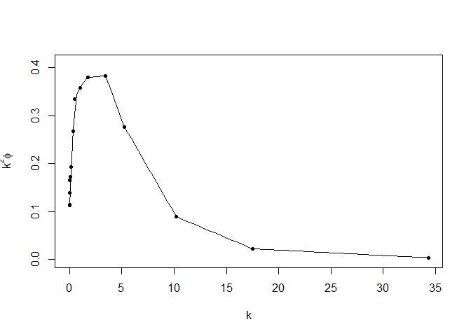

Ch2.6 OCE of Kelley
================
Taeyoon Song
February 24, 2020

## GitHub Documents

This is an R Markdown format used for publishing markdown documents to
GitHub. When you click the **Knit** button all R code chunks are run and
a markdown file (.md) suitable for publishing to GitHub is generated.

## 2.6.1 sorting

sort()는 정열된 벡터를 반환, 반면 order()는 데이터의 인덱스를 정열될 순서로 나열:

``` r
data(oceans, package="ocedata")
oceansOrdered <- oceans[order(oceans$AvgDepth),] # 컬럼기준 매트릭스 정열
oceans$rankByAvgDepth <- order(order(oceans$AvgDepth, decreasing = TRUE)) # Ranking 반환
```

## 2.6.2 해찾기

일변량 함수의 해는 `uniroot()`로 찾을 수 있음: 다항식 \(a_1 + a_2x + a_3x^2\) 의 해찾기

``` r
polyroot(c(-1, 0, 1))
```

    ## [1]  1+0i -1+0i

## 2.6.3 적분

함수의 적분은 `integrate()` \[\int_0^\pi \sin\theta\,d\theta\]

``` r
integrate(sin, 0, pi)
```

    ## 2 with absolute error < 2.2e-14

``` r
woa <- function(x, a=1)
  8 * a^3 / (x^2 + 4*a^2)
integrate(woa, -Inf, Inf)
```

    ## 12.56637 with absolute error < 1.3e-09

``` r
# Ex. 2.39
a <- 2
b <- 1
integrate(function(t)
  4*a*sqrt(1-(a^2-b^2)/a^2*sin(t)^2), 0, pi/2)
```

    ## 9.688448 with absolute error < 3.5e-10

## 2.6.4 Piecewise Linear Interpolation

``` r
data(ctd, package="oce")
p <- ctd[["pressure"]]
S <- ctd[["salinity"]]
Sinterp <- approx(p, S, seq(0, max(p), 0.5))$y
```

    ## Warning in regularize.values(x, y, ties, missing(ties)): collapsing to unique
    ## 'x' values

``` r
Sinterp
```

    ##  [1]       NA       NA       NA 29.92095 29.92059 29.92102 29.93364 29.95277
    ##  [9] 29.96976 30.12039 30.58780 30.77322 30.83560 30.92304 30.89010 30.92513
    ## [17] 30.96769 30.98939 31.02860 31.08169 31.09813 31.20260 31.20869 31.20815
    ## [25] 31.20885 31.26143 31.26104 31.27251 31.27565 31.29154 31.30949 31.30251
    ## [33] 31.35490 31.36916 31.37091 31.37815 31.37668 31.39969 31.40535 31.39840
    ## [41] 31.39832 31.39905 31.39652 31.42063 31.41852 31.42646 31.42914 31.44187
    ## [49] 31.43772 31.44280 31.44489 31.44937 31.44523 31.44506 31.44808 31.44164
    ## [57] 31.44225 31.44015 31.46703 31.43874 31.44648 31.46147 31.44558 31.45472
    ## [65] 31.44221 31.43161 31.42870 31.42552 31.42157 31.42086 31.41715 31.42057
    ## [73] 31.41248 31.41267 31.40959 31.41225 31.43074 31.40808 31.40724 31.40201
    ## [81] 31.39897 31.39681 31.39885 31.39535 31.40666 31.41978 31.39375 31.38905
    ## [89] 31.39440

\[\epsilon = 15 \nu \int_0^\infty k^2 \phi \,dk\]

``` r
data(turbulence, package="ocedata")
k <- turbulence$k
phi <- turbulence$phi
plot(k, k^2*phi, pch=20, ylim=c(0, 0.41),
     xlab=expression(k), ylab=expression(k^2*phi))
lfcn <- approxfun(k, k^2 * phi)
kk <- seq(min(k), max(k), length.out=100)
lines(kk, lfcn(kk))
```

<!-- -->

``` r
I <- integrate(lfcn, min(k), max(k))
nu <- 1e4 * swViscosity(35, 10) / swRho(35, 10, 10, eos="unesco")
15 * nu * I$value
```

    ## [1] 0.6810874

\``Note that the`echo = FALSE\` parameter was added to the code chunk to
prevent printing of the R code that generated the plot.
