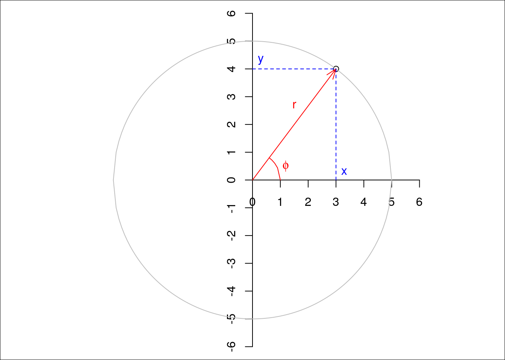
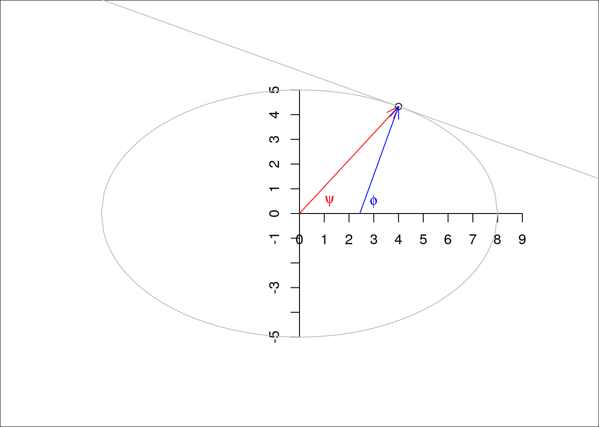

## Chapter 2 Coordinate systems
공간 데이터의 경우, 관측 위치는 좌표로 표현되며, 좌표는 좌표시스템에서 정의됨. 여러가지 좌표시스템이 여기에 사용되는데, 가장 중요한 차이는 좌표가 2차원, 또는 3차원 공간으로 정의되는데, 직각 축(orthogonal axes; Cartesian coordinates), 또는 거리와 방향(polar coordinates, spherical coordinate)로 참조됨.



## 2.1 Cartesian and geodetic coordinates
그림 2.1은 표준 2차원 상황에 대한 극좌표계와 직교좌표계 모두를 보여줌. 직교좌표계로 본 포인트는 (x, y)=(3,4)이며, 극좌표계에서는 $(r, \phi)$=(5, arctan(4/3))인데, 여기서 arctan(4/3)은 약 0.93 라디안, 또는 $53^{\circ}$임. 
직교좌표계와 극좌표계사이의 변환은 간단하다.
$$x=r\ cos\phi$$
$$y = r\ sin\phi$$
$$\phi = arctan(y/x)$$
$$r = \sqrt{(x^2 + y^2)}$$

## 2.2 Ellipsoidal coordinates
직교좌표계로는 (x, y, z)로 표현되는 3차원에서, 구형좌표계(spherical coordinates)는 극좌표계와 동등한 3차원이며, $(r, \lambda, \phi)$로 표현되는데, 
여기에는
- $r$는 구의 반경
- $\lambda$는 경도로써, (x, y) 평면의 양의 x로부터 반시계방향 측정되며
- $\phi$

$\lambda$는 일반적으로 $-180^\circ$에서 $180^\circ$(또는 대안으로서 $0^\circ$에서 $360^\circ$), $\phi$는 $-90^\circ$에서 $90^\circ$의 범위를 가짐.
타원체 상의 포인트인 경우, 각을 표현하는 방식은 2가지가 있는데, 하나는 타원체의 중심($\psi$)로부터 측정하는 것과, 타켓 포인트에서 타원체 상의 탄젠트에 직각으로 측정되는 경우($\phi$)임.
지구에 대한 가장 일반적으로 사용되는 파라메트릭 모델은 *an ellipsoid of revolution*. 이것은 납작한 구체로, 극점간의 거리는 적도 축의 거리보다 약 0.33%로 적음. 이 모델 하에서 경도는 원을 따라 측정되지만, 경도는 타원을 따라 측정됨. 만약 우리가 극점을 가로지르는 지구 단면을 그림과 같이 상상한다면, 위도값 $\phi$는 앞으로 특정되지 않는다면 이를 사용하는 것이며, 이를 geodetic latitude라고 부름. 위도값 $\psi$는 geocentric latitude라고 함. 




```{r}
plot(cars)
```

Add a new chunk by clicking the *Insert Chunk* button on the toolbar or by pressing *Ctrl+Alt+I*.

When you save the notebook, an HTML file containing the code and output will be saved alongside it (click the *Preview* button or press *Ctrl+Shift+K* to preview the HTML file).

The preview shows you a rendered HTML copy of the contents of the editor. Consequently, unlike *Knit*, *Preview* does not run any R code chunks. Instead, the output of the chunk when it was last run in the editor is displayed.
